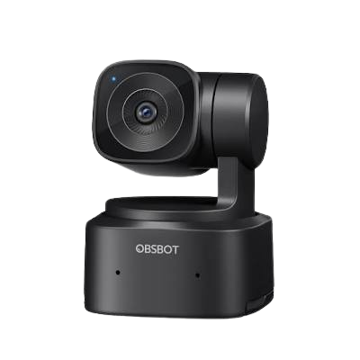

# OBSBOT Tiny SE Webcam

* https://www.obsbot.com/obsbot-tiny-se-full-hd-webcam

## Current State
* Webcam is working properly on Fedora using standard Linux stack UVC/V4L2.
* Webcam detected as regular UVC device (`/dev/video*`), so it works with:
	* OBS Studio
	* Browsers
	* WebRTC
	* ffplay
	* mpv
	* cheese
	* v4l2-ctl

---

## PTZ (Pan/Tilt/Zoom)

PTZ control validate via V4L2:

```bash
v4l2-ctl -d /dev/video0 --list-ctrls
```

Detected controls:

```text
pan_absolute
tilt_absolute
focus_absolute
exposure_time_absolute
```

Confirms:

* Pan functional
* Tilt functional
* Focus manual functional
* Exposure manual functional

---

## Gesture Control

Also validated:

- Gesture control working.
- Enabling/disabling human tracking.
- Enabling/disabling zooming (2x default).
- Enabling dynamic zooming.

We can conclude AI logic is working and implemented directly on firmware.

---

# What is not working or available

## Official Linux Application

* Does not exist at all.
* No SDK available.
* Advanced tracking configuration.
* Official OBSBOT support for Windows and macOS.

---

# Useful Linux Tools

## Controls

```bash
v4l2-ctl -d /dev/video0 --list-ctrls
```

---

## Manual Exposure

```bash
v4l2-ctl -d /dev/video0 \
  --set-ctrl=auto_exposure=1
```

---

## Adjust Exposure

```bash
v4l2-ctl -d /dev/video0 \
  --set-ctrl=exposure_time_absolute=150
```

---

## Moving the camera

### Pan

```bash
v4l2-ctl -d /dev/video0 \
  --set-ctrl=pan_absolute=0
```

### Tilt

```bash
v4l2-ctl -d /dev/video0 \
  --set-ctrl=tilt_absolute=0
```